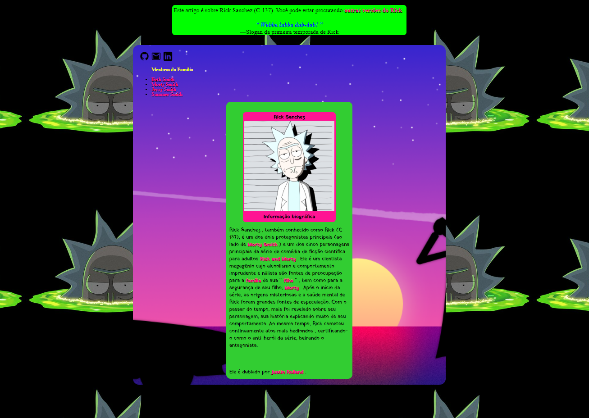

## Projeto Sanchez

> Projeto simples usando <mark>HTML5 e CSS3 .</mark>

<b> Nesse projeto falo um pouco sobre o personagem <i style="color:deeppink">Rick Sanchez</i> da série animada <mark style="background-color: lime">RickandMorty.<mark></b>

