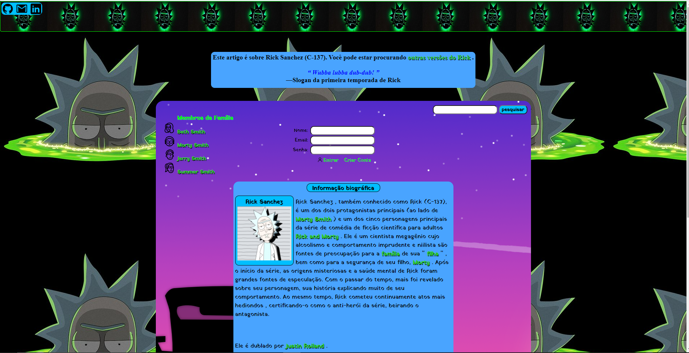

## Projeto Sanchez

> Projeto próprio.

<b> Nesse projeto falo um pouco sobre o personagem de um dos meus desenhos favoritos, <i>Rick Sanchez</i> da série animada Rick and Morty.</b>

<h2 align="center">
  Acesse a Interface do YouTube Clicando <a href="https://erick-sarges.github.io/Projeto-Sanchez/">AQUI</a>!
</h2>

<!--   -->

## :computer: Tecnologias utilizadas
O projeto foi desenvolvido utilizando as seguintes tecnologias:
- <b>HTML</b>
- <b>CSS</b>

